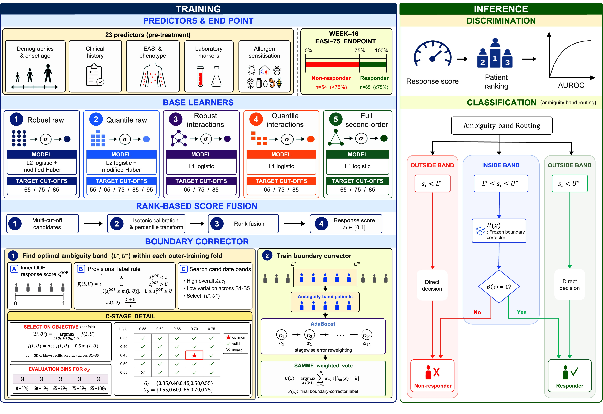

# Boundary-aware EASI-75 response prediction

Official reproducibility code for *Machine Learning Prediction of EASI-75
Response to Dupilumab in Atopic Dermatitis Using Baseline Clinical and Allergen
Sensitization Data*.

The study evaluates a five-learner, multi-cut-off rank-fusion score with a
training-fold ambiguity band and boundary corrector. In repeated nested internal
validation of 119 patients, the proposed framework achieved AUROC 0.824 (95% CI
0.747–0.892), sensitivity 0.738, specificity 0.778, and F1 0.768. Logistic
regression achieved AUROC 0.763; the paired difference was +0.061 (95% CI
0.014–0.111; DeLong p=0.012).



## Reproduce

Python 3.12 and [uv](https://docs.astral.sh/uv/) are required.

```bash
uv sync --frozen
uv run python scripts/run_all.py \
  --data data/private/raw_data_v5_260810.xlsx \
  --output outputs/reproduction \
  --jobs 8
```

The source workbook contains human participant information and is not public.
Authorized users can reproduce the complete analysis after placing the frozen
workbook at the path above. Public aggregate reference results, manuscript
tables, and figures are provided under `artifacts/reference/`.

## Repository map

```text
src/atopix_ml/       frozen model and preprocessing implementation
scripts/             experiment, statistics, table, figure, and audit entry points
artifacts/reference/ aggregate results and final display items
assets/schematics/   fixed non-data schematic sources
docs/                protocol, data access, traceability, and release audit
```

See [Reproducibility](docs/REPRODUCIBILITY.md), [Data](docs/DATA.md), and
[Manuscript traceability](docs/MANUSCRIPT_TRACEABILITY.md) for details.
The [release audit](docs/RELEASE_AUDIT.md) records full-rerun parity and the
remaining manuscript-package discrepancies.

## Scope

This is an internally validated development study, not a clinically deployable
tool. External multicentre validation is required before clinical use.

## License

Code is released under the MIT License. The participant-level study data are
not covered by this license and are not distributed here.
