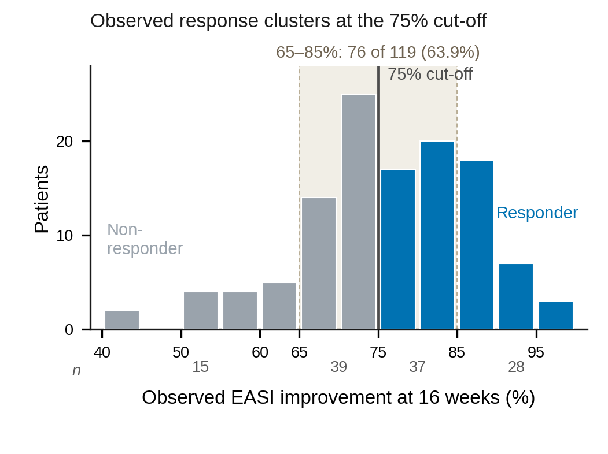
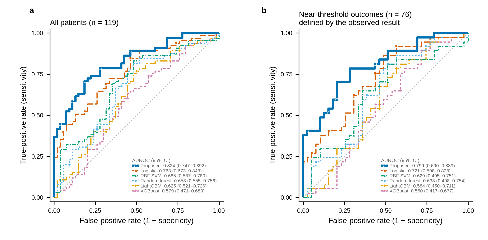
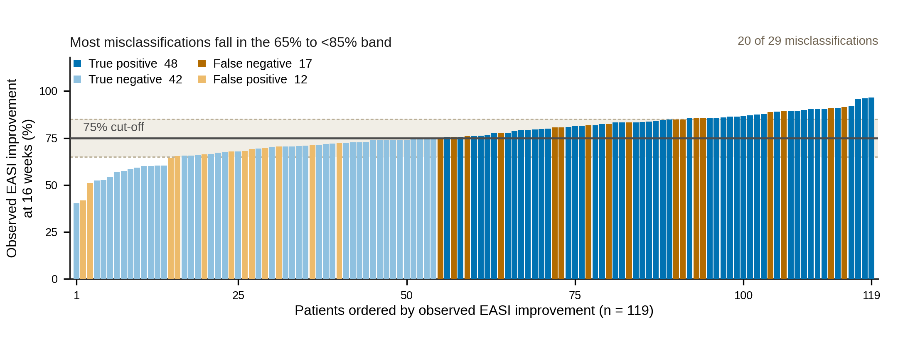
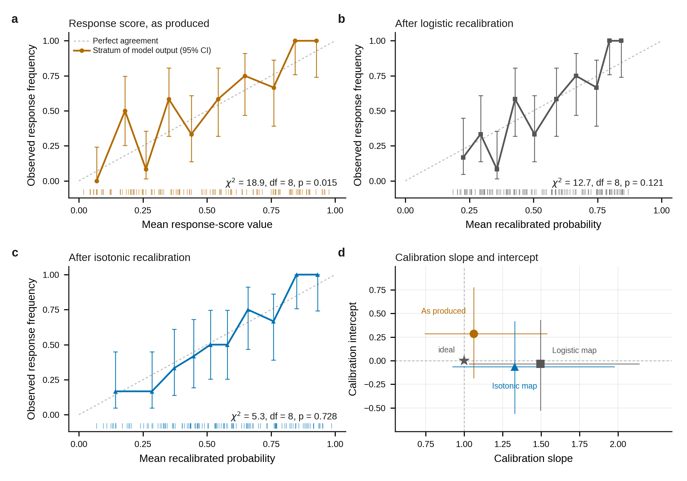
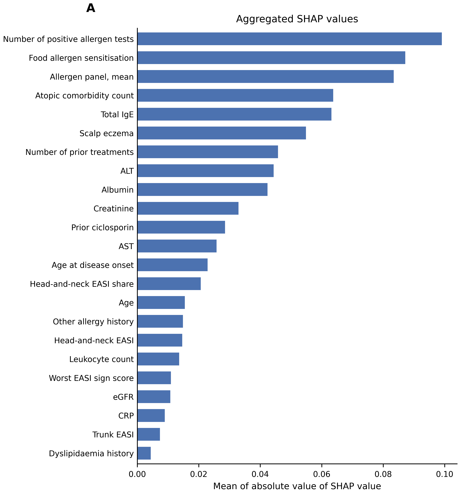

# Core results report

## Scope

This report summarizes the final results for *Machine Learning Prediction of
EASI-75 Response to Dupilumab in Atopic Dermatitis Using Baseline Clinical and
Allergen Sensitization Data*. All values come from the frozen aggregate
artifacts in [`artifacts/reference/`](../artifacts/reference/). The independent
analysis unit was the patient.

The central result is that a five-learner, multi-cut-off rank-fusion framework
with training-only ambiguity-band routing discriminated week-16 EASI-75 response
better than the five displayed comparators in repeated nested internal
validation. This is evidence from a model-development cohort, not external or
prospective clinical validation.

*Figure 1. Training and inference framework. This is the verbatim
author-supplied artifact. The executable uses `s_i > U*` for direct responder
assignment; the visible `s_i < U*` text in the right green box is documented in
the [release audit](RELEASE_AUDIT.md#manuscript-package-findings).*

## Study and validation design

| Item | Final specification |
|---|---|
| Cohort | 119 patients |
| Week-16 endpoint | 65 EASI-75 responders (54.6%); 54 non-responders (45.4%) |
| Observed EASI improvement | 76.11% ± 11.18% overall |
| Pre-treatment inputs | 23 clinical and allergen-sensitization predictors |
| Outer validation | 15 fixed seeds × 5 regression-stratified folds (75 fitted folds) |
| Inner validation | 5 folds within each outer-training partition |
| Patient-level discrimination | Mean of 15 held-out response scores |
| Patient-level classification | Majority vote of 15 held-out decisions |
| Uncertainty | 10,000 patient-level bootstrap resamples, seed 42 |
| Paired inference | DeLong test for AUROC; exact McNemar test for classification |
| Multiplicity | Holm correction across five displayed comparators, separately by test family |

Every proposed-framework fold passed the held-out-outcome corruption probe
(75/75). The learned quantities were therefore unchanged when held-out labels
were corrupted, supporting the absence of outcome leakage through the fitted
pipeline.

*Figure 2. Distribution of observed week-16 EASI improvement and the
retrospective 65% to <85% near-threshold outcome stratum.*

## Primary performance

The patient-averaged held-out response score achieved an AUROC of 0.824 (95% CI
0.747–0.892) and an area under the precision-recall curve of 0.869. The final
boundary-aware decisions correctly classified 90 of 119 patients, for an
accuracy of 0.756 (bootstrap 95% CI 0.672–0.832), sensitivity of 0.738,
specificity of 0.778, and F1 score of 0.768. The confusion matrix comprised 48
true positives, 42 true negatives, 12 false positives, and 17 false negatives.

*Figure 3. Held-out discrimination of the proposed framework and displayed
comparators in the complete cohort and near-threshold outcome stratum.*

| Model | AUROC (95% CI) | Sensitivity | Specificity | F1 |
|---|---:|---:|---:|---:|
| **Proposed framework** | **0.824 (0.747–0.892)** | **0.738** | **0.778** | **0.768** |
| Logistic regression | 0.763 (0.673–0.843) | 0.646 | 0.611 | 0.656 |
| Support vector machine (RBF kernel) | 0.685 (0.587–0.780) | 0.554 | 0.685 | 0.610 |
| Random forest | 0.658 (0.555–0.756) | 0.646 | 0.593 | 0.651 |
| LightGBM | 0.625 (0.521–0.726) | 0.554 | 0.593 | 0.585 |
| XGBoost | 0.579 (0.471–0.683) | 0.662 | 0.463 | 0.628 |

The proposed score exceeded each comparator in paired AUROC analysis. The
smallest difference was +0.061 versus logistic regression (95% CI
0.014–0.111; DeLong p=0.01185). All five comparisons remained below 0.05 after
Holm correction. Exact paired classification tests also favored the proposed
framework after correction.

| Comparator | ΔAUROC (95% CI) | DeLong p | Holm-adjusted p | Correct only by framework / comparator | Holm-adjusted McNemar p |
|---|---:|---:|---:|---:|---:|
| Logistic regression | +0.061 (0.014–0.111) | 0.01185 | 0.01185 | 19 / 4 | 0.00520 |
| Support vector machine (RBF kernel) | +0.138 (0.076–0.205) | 3.31×10⁻⁵ | 6.62×10⁻⁵ | 22 / 5 | 0.00454 |
| Random forest | +0.166 (0.095–0.242) | 7.14×10⁻⁶ | 2.14×10⁻⁵ | 24 / 8 | 0.00700 |
| LightGBM | +0.199 (0.123–0.279) | 4.22×10⁻⁷ | 1.69×10⁻⁶ | 28 / 6 | 0.000976 |
| XGBoost | +0.245 (0.161–0.331) | 1.29×10⁻⁸ | 6.43×10⁻⁸ | 28 / 6 | 0.000976 |

`ΔAUROC` is the proposed-framework AUROC minus the comparator AUROC. All models
used the same patients, predictors, outer/inner partitions, and training-only
preprocessing. Comparator decision thresholds were selected from inner
out-of-fold predictions within each outer-training partition.

## Boundary behavior and component contribution

The retrospective near-threshold outcome stratum contained 76 patients with an
observed EASI improvement from 65% to <85% (37 responders and 39
non-responders). In this stratum, the framework achieved AUROC 0.799 (95% CI
0.690–0.889), accuracy 0.737, sensitivity 0.703, specificity 0.769, and F1
0.722. Twenty of the 29 total errors occurred in the stratum. Because the
stratum itself contained 63.9% of the cohort, this error concentration was not
greater than expected at this sample size (Fisher p=0.657).

The near-threshold stratum is defined using the observed outcome and is
available only retrospectively. It is not the same as the model's ambiguity
band, which is selected within training data and can be applied to a new
patient's baseline response score.

*Figure 4. Patient-level week-16 EASI improvement and final framework
classification.*

The ablation sequence localized the discrimination gain to multi-cut-off
learning and five-learner score fusion. Adding the ambiguity band alone did not
change the continuous score. Applying the boundary corrector then increased
overall accuracy from 0.739 to 0.756 and near-threshold accuracy from 0.711 to
0.737, while AUROC remained unchanged because the corrector modifies decisions,
not score rankings.

| Stage | Configuration | AUROC | Overall accuracy | Near-threshold accuracy |
|---|---|---:|---:|---:|
| 1 | Conventional single-endpoint logistic regression | 0.763 | 0.630 | 0.592 |
| 2 | One learner fitted across adjacent cut-offs | 0.786 | 0.706 | 0.658 |
| 3 | Five learners combined into the response score | 0.824 | 0.739 | 0.711 |
| 4 | Ambiguity band without the boundary corrector | 0.824 | 0.739 | 0.711 |
| 5 | Complete framework | 0.824 | 0.756 | 0.737 |

## Calibration

The raw rank-fusion score had a Brier score of 0.173 and expected calibration
error (ECE) of 0.061. Isotonic recalibration produced the lowest ECE (0.048)
and a similar Brier score (0.172). Logistic recalibration did not improve either
summary. Calibration estimates remain internally validated estimates from 119
patients and should not be interpreted as external probability validation.

| Output | Brier score ↓ | ECE ↓ | Calibration slope (95% CI) | Calibration intercept (95% CI) | Hosmer–Lemeshow p |
|---|---:|---:|---:|---:|---:|
| Raw response score | 0.173 | 0.061 | 1.062 (0.745–1.537) | 0.285 (-0.183 to 0.774) | 0.015 |
| Logistic recalibration | 0.178 | 0.067 | 1.495 (1.032–2.136) | -0.035 (-0.526 to 0.428) | 0.121 |
| Isotonic recalibration | 0.172 | 0.048 | 1.328 (0.924–1.975) | -0.063 (-0.559 to 0.413) | 0.728 |

*Supplementary Figure S1. Fold-fitted calibration analyses. The
Hosmer–Lemeshow test is reported for completeness but is not used as the sole
assessment of calibration.*

## Endpoint-definition sensitivity

Reusing the fixed held-out predictions across alternative EASI-improvement
cut-offs showed the strongest discrimination at the prespecified 75% endpoint.
Performance remained similar at 74%–77.5% and declined at more distant 70% and
80% definitions. These analyses test label-definition sensitivity; they are not
independent validation datasets.

| EASI-improvement cut-off | Labels changed vs 75% | Responders | AUROC | Sensitivity | Specificity | F1 |
|---|---:|---:|---:|---:|---:|---:|
| 70% | 25 | 90 | 0.695 | 0.567 | 0.690 | 0.680 |
| 72.5% | 13 | 78 | 0.733 | 0.615 | 0.707 | 0.696 |
| 74% | 7 | 72 | 0.783 | 0.667 | 0.745 | 0.727 |
| **75% (reference)** | **0** | **65** | **0.824** | **0.738** | **0.778** | **0.768** |
| 76% | 4 | 61 | 0.812 | 0.754 | 0.759 | 0.760 |
| 77.5% | 8 | 57 | 0.797 | 0.754 | 0.726 | 0.735 |
| 80% | 17 | 48 | 0.739 | 0.729 | 0.648 | 0.648 |

## Feature attribution

The five largest mean absolute SHAP contributions in the manuscript aggregate
were the number of positive allergen tests (12.1% of total absolute
contribution), food allergen sensitisation (10.7%), mean allergen-panel value
(10.2%), atopic comorbidity count (7.8%), and total IgE (7.7%). These values
describe model attribution, not causal effects or independently validated
biomarkers.

*Figure 5. Aggregate score attribution across the 23 pre-treatment predictors.*

The original KernelSHAP run did not seed the perturbation sampler. A fresh run
preserved the same top-five variable set but swapped the nearly tied fourth and
fifth positions and changed absolute values by approximately 10⁻⁴ to 10⁻³. The
release runner now uses deterministic fold-specific seeds; interpretation is
therefore limited to the stable top group rather than adjacent rank order.

## Interpretation boundaries

- This is repeated nested internal validation in one 119-patient development
  cohort. External multicentre and prospective validation is required before
  clinical use.
- The response score supports ranking and internally evaluated classification.
  Its values should not be treated as externally calibrated individual response
  probabilities.
- The near-threshold outcome stratum is retrospective and cannot be identified
  from baseline information alone.
- Feature attributions are model-specific associations. They do not establish
  biological mechanism, treatment-effect heterogeneity, or causality.
- Baseline-characteristic p values in Table 1 are descriptive and exploratory;
  they do not establish independently validated biomarkers.
- Participant-level data are restricted because the source workbook contains
  sensitive clinical information and direct identifiers. The public repository
  therefore distributes aggregate results and display items only.

## Result-to-artifact index

| Result family | Human-readable table | Machine-readable source |
|---|---|---|
| Cohort characteristics | [`table1.csv`](../artifacts/reference/tables/table1.csv) | restricted source workbook |
| Primary and comparator performance | [`table2.csv`](../artifacts/reference/tables/table2.csv) | [`model_metrics.csv`](../artifacts/reference/results/model_metrics.csv), [`metrics.json`](../artifacts/reference/results/metrics.json) |
| Paired discrimination and classification | [`tableS3.csv`](../artifacts/reference/tables/tableS3.csv) | [`discrimination_comparison.csv`](../artifacts/reference/results/discrimination_comparison.csv), [`classification_comparison.csv`](../artifacts/reference/results/classification_comparison.csv) |
| Calibration | [`tableS4.csv`](../artifacts/reference/tables/tableS4.csv) | [`calibration_summary.csv`](../artifacts/reference/results/calibration_summary.csv) |
| Feature attribution | [`tableS6.csv`](../artifacts/reference/tables/tableS6.csv) | [`feature_importance.csv`](../artifacts/reference/results/feature_importance.csv) |
| Near-threshold outcomes | [`tableS7.csv`](../artifacts/reference/tables/tableS7.csv) | [`boundary_stratum_comparison.csv`](../artifacts/reference/results/boundary_stratum_comparison.csv) |
| Ablation | [`tableS8.csv`](../artifacts/reference/tables/tableS8.csv) | [`ablation_stages.csv`](../artifacts/reference/results/ablation_stages.csv) |
| Endpoint sensitivity | [`tableS9.csv`](../artifacts/reference/tables/tableS9.csv) | [`tableS9.csv`](../artifacts/reference/tables/tableS9.csv) |
| Secondary routing analyses | — | [`revision_analyses.json`](../artifacts/reference/results/revision_analyses.json) |

For the exact execution contract and one-command rerun, see
[Reproducibility](REPRODUCIBILITY.md). For known manuscript-package and SHAP
provenance findings, see the [release audit](RELEASE_AUDIT.md).
